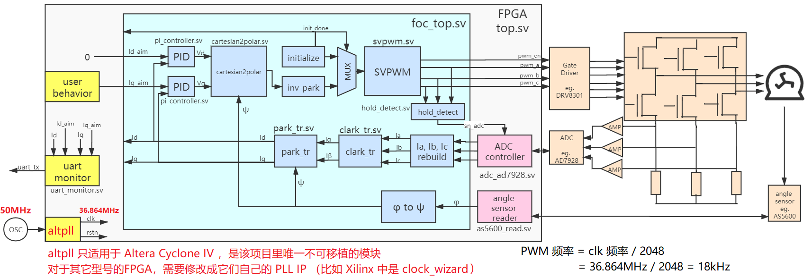
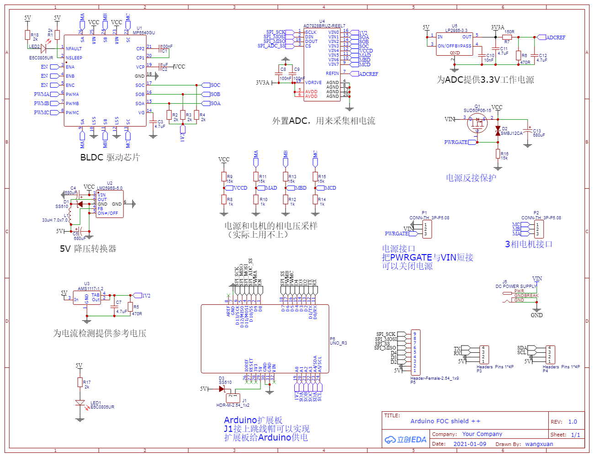
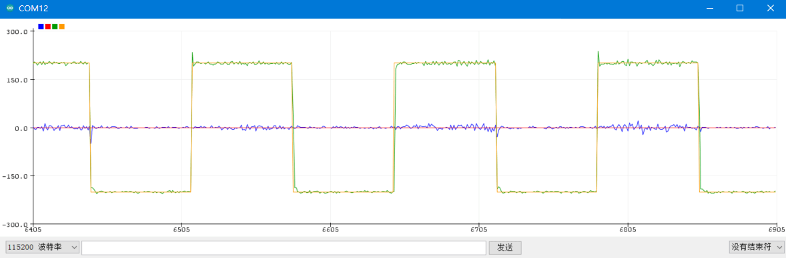
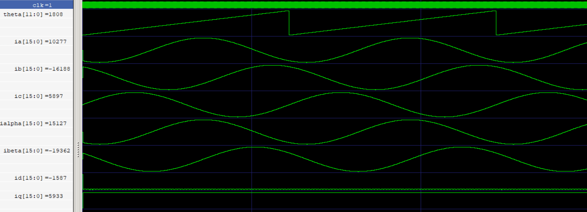
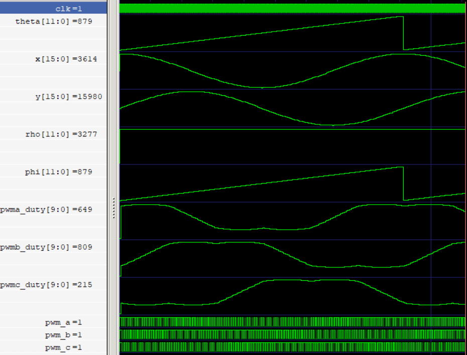
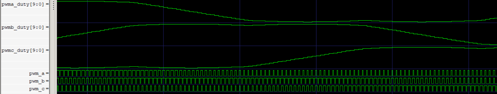

-9A90FD.svg)   

[English](#en) | [中文](#cn)

　

<span id="en">FpOC</span>
===========================

**FPGA** based **Field Oriented Control (FOC)** for driving **Permanent Magnet Synchronous Motors (PMSM)** or **Brushless DC Motors (BLDC)**

**FOC** puts forward certain requirements on sensor sampling rate and processor computing. Using an FPGA-based FOC can achieve better real-time performance and is more convenient for **multi-channel expansion** and **multi-channel feedback**.

This repository implements FOC based on a **angle sensor** (such as a magnetic encoder). In other word, it implements a complete **current loop** which can perform **torque control**. With this repository, you can further implement more complex motor applications using FPGA or MCU+FPGA.

|  |
| :-------------------------------: |
|   **Figure1**: System diagram.    |

The code in this repository has detailed comments (in Chinese). If you are familiar with Verilog but not familiar with FOC, you can quickly learn FOC by reading the code.

### Technical features

* Platform independent：Written in pure Verilog, able to run on various FPGAs such as Altera and Xilinx.
* Support **3 channels of PWM** + **1 channel of EN**: when PWM=1, the upper MOSFET turns on, and when PWM=0, the lower MOSFET turns on. When EN=0, all 6 MOSFET are turned off.
* Supports **angle sensor** and **phase current sampling ADC** with **12bit resolution**. For sensors >12bit, low-order truncation is required. For sensors <12bit, low-bit stuffing is required.

* Internally uses **16bit signed integer** for computation, considering that the sensors are 12bit, so 16bit computation is enough.

### Table of contents

- [Demo project: let your motor spin](#en1)
  - [Build Hardware](#en11)
  - [Create FPGA project](#en12)
  - [parameter tuning](#en13)
  - [Monitor current using serial port](#en14)
- [Design code](#en2)
- [RTL simulation](#en3)
  - [simulate clark_tr and park_tr](#en31)
  - [simulate cartesian2polar and svpwm](#en32)

　

# <span id="en1">Demo project: let your motor spin</span>

Figure1 is the system block diagram of the demo project, it has a simple behavior: control the current (torque) of the motor in clockwise and counterclockwise alternately. At the same time, it use the UART to print the **target value** and **actual value** of the current in order to monitor the quality of the current loop control.

All the code for this demo are in [RTL](./RTL) folder.

## <span id="en11">Build Hardware</span>

The hardware required to run this demo includes:

* FPGA board : at least 10 3.3V IO is required, connect to:
  * **I2C (2*IO)** , connect to AS5600 magnetic encoder (angle sensor)
  * **SPI (4*IO)** , connect to AD7928 ADC for phase current sampling.
  * **PWM (3*IO)** , output 3-phase PWM to motor driving MOSFETs (typically on a motor driving board).
  * **PWM_EN (1*IO)** , output a ENABLE signal to motor driving board, PWM_EN=0 is to turn off all MOSFETs. If there's no enable signal on your motor driving board, left it open.
  * **UART (1*IO)** , a one-way (only sending) UART, **optionally** connected to the serial port of the computer, used to monitor the current loop.
* A PMSM or a BLDC.
* **Motor driving board**: Must support 3-phase PWM input signal (the lower arm is turned on when PWM=0, and the upper arm is turned on when PWM=1), and 3 phases **low-side resistance sampling + amplifier** must be built-in.
* **A magnetic encoder to obtain the roter angle**: This demo directly supports AS5600, which needs to be installed on the motor.
* **an ADC to sample 3-phase current**: This demo directly supports AD7928.
  * I didn't find any off-the-shelf AD7928 module online, so if you want to DIY, you'll need to draw the PCB yourself.

If you have strong hardware skills, you can prepare the above hardware yourself.

But! It is recommended to directly use a **motor driver board** with an **AD7928** that I drew. Its schematic is shown in **Figure2**, and I also provide its manufacturing file [gerber_pcb_foc_shield.zip](./gerber_pcb_foc_shield .zip) , you need to take the manufacturing file to proof the PCB, and then solder it according to **Figure2**.

> Note: This board includes the **phase current sampling ADC** and **motor driveing**, but does not include the AS5600 magnetic encoder, which needs to be installed on the motor. You need to prepare it additionally.

|                                     |
| :----------------------------------------------------------: |
| **Figure2**: The schematic of my motor driver board, including AD7928 ADC. |

This board is open source in LCEDA, see [oshwhub.com/wangxuan/arduino-foc-shield](https://oshwhub.com/wangxuan/arduino-foc-shield) .

The reason why this board is designed as an Arduino shield is because many FPGA development boards have an Arduino shield interface (such as DE10-Nano development board) that can be plugged directly into it. It doesn't matter if your FPGA development board does not have an Arduino shield interface, you can directly connect it with Dupont cables (short Dupont cable is recommended).

The motor driver used here is the **MP6540** chip, I have only tried to drive the low-power gimbal motor, but not the high-power motor.

## <span id="en12">Create FPGA project</span>

You need to create an FPGA project and add all the .v source files in the [RTL](./RTL) folder (including its subdirectories) to the project. Please use fpga_top.v as the top-level file.

### clock config

There is a call to the `altpll` primitive in fpga_top.v, which convert the 50MHz clock (clk\_50m signal) input by the crystal oscillator into a 36.864MHz main clock (clk signal). The `altpll` primitive is only applicable in Altera Cyclone IV FPGA, if you are using other series of FPGAs, you need to replace it with their IP cores or primitives (e.g. Xilinx's clock wizard).

If the crystal oscillator of your development board is not 50MHz, you need to modify the PLL's configuration to ensure that the frequency of the main clock is 36.864MHz.

In fact, the frequency of the main clock can take any value less than 40MHz. main clock is to drive the FOC system, its frequency will determine the frequency of SVPWM (SVPWM frequency = clk frequency/2048), I choose 36.864MHz because it can make SVPWM frequency = 36864/2048 = 18kHz.

The reason why the frequency of main clock cannot exceed 40MHz is that adc_ad7928.v will generate the SPI clock (spi\_sck signal) by dividing the frequency by two, and the ADC7928 chip requires that the SPI clock cannot exceed 20MHz.

### pin constraints

The IO connection of fpga_top.v is as follows:

* `clk_50m` : connect to the crystal oscillator on FPGA board.
* `i2c_scl`, `i2c_sda` : connect to AS5600's I2C.
* `spi_ss`, `spi_sck`, `spi_mosi`, `spi_miso` : connect to AD7928's SPI. 
* `pwm_a`, `pwm_b`, `pwm_c` : connect to 3-phase PWM of the motor driving board.
* `pwm_en` : connect to the ENABLE signal of the motor driving board.
  * If there's no ENABLE signal, left it open.
  * If there are 3 ENABLE signals for every 3 phases, then 1-to-3 connect is recommended.
* `uart_tx` : **optionally** connect to the Serial Port of computer (e.g., a UART-to-USB module).

## <span id="en13">parameter tuning</span>

To make the motor work normally, you need to tune the Verilog parameters of foc_top module which starts from 103 line in fpga_top.v, including:

| Parameter      | Value Range   | Illustration                                                 |
| -------------- | ------------- | ------------------------------------------------------------ |
| `INIT_CYCLES`  | 1\~4294967293 | Determines how many clock (clk) cycles the initialization step takes. The value should not be too small, as there should be enough time for the rotor to return to electrical angle =0. For example, when the clk frequency is 36.864MHz, you can take `INIT_CYCLES=16777216`, then the initialization time is `16777216/36864000=0.45` seconds. |
| `ANGLE_INV`    | 0 or 1        | If the angle sensor is not installed reversely (the rotation direction of phase A → phase B → phase C → phase A is the same as the increasing direction of the reading value of the angle sensor), this parameter should be set to 0. If the angle sensor is installed reversely, this parameter should be set to 1. |
| `POLE_PAIR`    | 1\~255        | The number of pole pairs of the motor, which is determined according to the motor model (note: electrical angle ψ = number of pole pairs \* mechanical angle φ). |
| `MAX_AMP`      | 1\~511        | The maximum duty of SVPWM, the smaller the value, the smaller torque the motor can achieve. But considering that we use the lower arm resistance sampling method, the value should not be too large to ensure that the lower arms have sufficient time for ADC sampling. In this example, the default value of `9'd384` is sufficient. |
| `SAMPLE_DELAY` | 0\~511        | Sampling delay, considering that the 3-phase drive MOSFET needs a certain time from the start of conduction to the current stabilization, so a certain delay is required from the conduction of the three lower arms to the ADC sampling time. This parameter determines how many clock cycles this delay is, and when the delay is over, the module generates a high-level pulse on the `sn_adc` signal, indicating that the external ADC is "ready to sample". In this example, the default value of `9'd120` is sufficient. |

In addition, foc_top module has two input ports `Kp` and `Ki` , they are parameters for PID controller. They will affect the quality of control. They can be adjusted at runtime, but you can also input fixed constants for them.

```verilog
// ports of foc_top.v
input  wire        [30:0] Kp,
input  wire        [30:0] Ki,
```

After tuning the parameters, you can compile and program to the FPGA. You should be able to see the motor spining clockwize and anticlockwize alternately.

## <span id="en14">Monitor current using serial port</span>

Connect the `uart_tx` signal to the computer through **UART to USB module** (such as CP2102, CH340 module), you can use **Serial Assistant**, **Putty**, **HyperTerminal**, **minicom** or other serial port software to monitor the controll effect of the current loop.

> Note : UART config is 115200,8,n,1

The information printed by the serial port is shown as follow. The first to fourth columns are: **actual value of d-axis current**, **target value of d-axis current**, **actual value of q-axis current**, **target value of q-axis current **. It can be seen that even if the target value suddenly changes from +200 to -200, the actual value can follow the target value, indicating that the PID control of the current loop is available.

```
     -5       0     206     200 
    -16       0     202     200 
     16       0     192     200 
     15       0     201     200 
      1       0     197     200 
     17       0    -211    -200 
     -6       0    -199    -200 
    -10       0    -210    -200 
     -3       0    -207    -200 
      0       0    -202    -200 
    -15       0    -211    -200 
```

In addition, you can use the **serial plotter** of **Arduino IDE** to display the current following curve in real time. Go to [Arduino official website](https://www.arduino.cc/en/software) to download **Arduino IDE**, open it after installation, select the correct COM port in "**Tools→Port**", then Click "**Tools→Serial Port Plotter**". It will automatically receive the serial port and use the above 4 columns of data to draw real-time curves.

**Figure3** is the current following curves that I obtain. The blue curve is the data in the first column (the actual value of the d-axis current); the red curve is the data in the second column (the target value of the d-axis current); the green curve is the data in the third column (the actual value of the q-axis current); the yellow curve is the 4th column data (target value of q-axis current). It can be seen that the actual value can follow the target value.

|                                   |
| :----------------------------------------------------------: |
| **Figure3** : current following curve printed by the "Serial Port Plotter" in Arduino IDE. |

　

# <span id="en2">Design code</span>

The following table lists all the **Verilog** code files in this project, which are in the [RTL](./RTL) folder. Combined with **Figure1**, you can see the role of each module.

| File Name            | Function                                                     | 备注                                                |
| :------------------- | :----------------------------------------------------------- | :-------------------------------------------------- |
| fpga_top.v          | FPGA project's top module                                    |                                                     |
| uart_monitor.v      | UART sender.                                                 | Can be removed if not used.                         |
| i2c_register_read.v | Read AS5600 magnetic encoder.                                |                                                     |
| adc_ad7928.v        | Read AD7928 ADC.                                             |                                                     |
| foc_top.v           | FOC+SVPWM, that is, the blue part in **Figure1**.            | Fixed function, generally do not need to be changed |
| clark_tr.v          | Clark transform.                                             | Fixed function, generally do not need to be changed |
| park_tr.v           | Park transform.                                              | Fixed function, generally do not need to be changed |
| sincos.v            | Sine/Cosine calculator, called by park_tr.v                 | Fixed function, generally do not need to be changed |
| pi_controller.v     | PI controller (PID without D).                               | Fixed function, generally do not need to be changed |
| cartesian2polar.v   | Cartesian coordinate system to polar coordinate system.      | Fixed function, generally do not need to be changed |
| svpwm.v             | SVPWM 调制器                                                 | Fixed function, generally do not need to be changed |
| hold_detect.v       | When three lower bridge arms are all turned on, pulse the sn_adc signal after a delay, indicating that the ADC can start sampling. | Fixed function, generally do not need to be changed |


|  |
| :-------------------------------: |
|   **Figure1**: System diagram.    |

**Figure1** shows the hierarchy of these modules, I have fully considered the rationality of encapsulation and code reuse when designing this module hierarchy:

* The **pink** part are the sensor controllers in the FPGA, which is **hardware related logic**. If the angle sensor and ADC model change, this part of the code needs to be rewritten.
* The **blue** part is the fixed algorithm of FOC, it is **hardware independent logic**, generally does not need to be modified, it is the core code of this library!
* The **yellow** part is the **user-defined logic** in the FPGA, the user can modify the user behavior to realize various motor applications. Or modify `uart_monitor` to monitor other variables.
* The **orange** part is the hardware circuit outside the FPGA, that is, the motor, the motor driver board, and the angle sensor.

In addition, except for the `altpll` primitives in fpga_top.v, all code in this library is written in pure RTL and can be easily ported to FPGAs from other vendors (Xilinx, Lattice, etc.).

　

# <span id="en3">RTL simulation</span>

Because I don't have a Verilog model of the motor, I can't simulate the entire FOC algorithm, so I only simulated some of the submodules in the FOC.

The simulation related files are all in the [SIM](./SIM) folder, including the files:

| File Name                         | Function                                                     |
| --------------------------------- | ------------------------------------------------------------ |
| tb_clark_park_tr.v               | Testbench for clark_tr.v (clark transform) and park_tr.v (park transform). |
| tb_clark_park_tr_run_iverilog.bat | Command script to run tb_clark_park_tr.v with iverilog.     |
| tb_svpwm.v                       | Testbench for cartesian2polar.v and svpwm.v.               |
| tb_svpwm_run_iverilog.bat         | Command script to run tb_svpwm.v with iverilog.             |

Before using iverilog simulation, you need to install iverilog , see: [iverilog_usage](https://github.com/WangXuan95/WangXuan95/blob/main/iverilog_usage/iverilog_usage.md)

## <span id="en31">simulate clark_tr and park_tr</span>

Let's run a simulation of the clark transform and park transform first.

Directly double-click tb_clark_park_tr_run_iverilog.bat to run the simulation, the waveform file dump.vcd will be generated after running. Use gtkwave to open dump.vcd. After importing signals, you can see the waveform as **Figure4**. You need to change these signals to the form of analog display:

- For the signal declared as `signed` in the Verilog code, you need to right-click "signal→Data Format→Signed Decimal".
- Right-click the "signal→Data Format→ Analog→Step" to turn it into the form of analog display.

The simulation waveform in **Figure4** shows that:

- theta θ is an increasmental angle (0→2π→0→2π→...)
- ia, ib, ic are sine waves generated by θ, ia, ib, ic form a 3-phase sine wave.
- Transform ia, ib, ic into ialpha (iα), ibeta (iβ) using clark transform to get a pair of quadrature sine waves (phase difference is π/2).
- Use park transformation to convert (iα, iβ) to the stator coordinate system to get fixed values id and iq.

|          |
| :---------------------------------------------------------: |
| **Figure4** : Simulation waveform for clark_tr and park_tr. |

## <span id="en32">simulate cartesian2polar and svpwm</span>

Now run the simulation of cartesian2polar (cartesian to polar) and svpwm.

Directly double-click tb_svpwm_run_iverilog.bat to run the simulation, and the waveform file dump.vcd will be generated after running. Please open dump.vcd with gtkwave, you can see the waveform as **Figure5**.

Note: The three signals `pwma_duty`, `pwmb_duty`, and `pwmc_duty` are not in the top level. You can find them in the svpwm module.

Interpretation of **Figure5** waveform:

- theta θ is an increasmental angle (0→2π→0→2π→...)
- x and y are quadrature sine waves generated with θ (in other words, y is a sine wave and x is a cosine wave).
- Treat (x,y) as a Cartesian coordinate value, then cartesian2polar converts it to a polar coordinate system (rho, phi)=(ρ, φ).
- Sending (ρ, φ) to svpwm, it will generate 3 saddle waves: `pwma_duty`, `pwmb_duty`, and `pwmc_duty`. If you are familiar with the principle of seven-segment SVPWM, you should know why it is a saddle wave, and I will not introduce it here.
- `pwma_duty`, `pwmb_duty`, `pwmc_duty` determine the duty cycle of `pwm_a`, `pwm_b`, `pwm_c` respectively. You can zoom in on the waveform to verify this, see **Figure6**.

|                           |
| :----------------------------------------------------------: |
| **Figure5** : Simulation waveform of cartesian2polar and svpwm. |

|  |
| :-------------------------------------: |
|     **Figure6** : Zoom in Figure5.      |

　

　

　

　

　

<span id="cn">FpOC</span>
===========================

基于 **FPGA** 的**磁场定向控制 (FOC)**，用于驱动**永磁同步电机 (PMSM)** 或**无刷直流电机 (BLDC)**

**FOC控制算法**对传感器采样速率和处理器算力提出了一定的要求，使用 **FPGA** 实现的 **FOC** 可以获得更好的**实时性**，并且更方便进行**多路扩展**和**多路反馈协同**。

本库实现了基于**角度传感器**（也就是磁编码器）的**有感 FOC**，即一个完整的**电流环**，可以进行**扭矩控制**。借助本库，你可以进一步使用 **纯FPGA** 或 **MCU+FPGA** 的方式实现更复杂的电机应用。

|  |
| :---: |
| **图1**：系统框图 |

本库代码有详细的注释，如果你熟悉 Verilog 但不熟悉 FOC ，可以通过阅读代码来快速地学习 FOC （建议先阅读 FOC 原理 [6~9]）。一些用户在读代码时向本人反馈了一些疑问，我将它们整理在了 [FAQ](#FAQ) 里。

### 技术特点

* **平台无关** ：纯 RTL 编写，可以在 Altera 和 Xilinx 等各种 FPGA 上运行。
* 支持 **3路PWM** + **1路EN** ：PWM=1 时上桥臂 MOS 导通，PWM=0 时下桥臂 MOS 导通。 EN=0 时所有的 6 个 MOS 关断。
* 支持 **12bit 分辨率**的**角度传感器**和**相电流采样ADC**。对于>12bit的传感器，需要进行低位截断。对于<12bit的传感器，需要进行低位填充。
* 内部使用 **16bit 有符号整数**进行计算，考虑到传感器为 12bit，所以 16bit 计算是够用的。

### 目录

- [示例程序：让电机转起来](#示例程序：让电机转起来)
  - [搭建硬件](#搭建硬件)
  - [建立FPGA工程](#建立FPGA工程)
  - [调参](#调参)
  - [用串口监视电流环](#用串口监视电流环)
- [设计代码详解](#设计代码详解)
- [RTL仿真](#RTL仿真)
  - [clark_tr和park_tr子模块的仿真](#clark_tr和park_tr的仿真)
  - [cartesian2polar和svpwm子模块的仿真](#cartesian2polar和svpwm的仿真)
- [FAQ](#FAQ)

　

# 示例程序：让电机转起来

**图1** 是示例程序的系统框图，它调用了我实现的 FOC 电流环模块 (foc_top.v) 来实现一个简单的行为——控制电机的电流（扭矩）按顺时针、逆时针、顺时针、逆时针地交替运行。同时，使用 UART 打印电流的**控制目标值**和**实际值**，以便观察 FOC 电流环控制的质量。

该示例的所有代码都在 RTL 目录内。


## 搭建硬件

运行本示例所需要的硬件包括：

* **FPGA 开发板** ：需有至少 10 个 3.3V 的 IO ，用来接：
    * **I2C (2*IO)** ， 用来连接 AS5600 磁编码器。
    * **SPI (4*IO)** ， 用来连接 AD7928 ADC。
    * **PWM (3*IO)** ， 用来输出 3 相 PWM 到电机驱动板。
    * **PWM_EN (1*IO)** ， 用来输出 1 路 EN (使能) 到电机驱动板（PWM_EN=低电平代表所有桥臂关断）。
    * **UART (1*IO)** ，单向(仅发送)的UART，连接计算机的串口，用于监测电流环的跟随曲线，**可不接**。
* **PMSM** 或 **BLDC 电机**。
* **电机驱动板**：要支持3相 PWM 输入信号（PWM=0时下桥臂导通，PWM=1时上桥臂导通），并且要内置**低侧电阻采样+放大器**对 3 相电流进行放大。
* **获取转子角度的磁编码器**：本库直接支持的型号是 AS5600 ，需要安装在电机上。
* **相电流采样的ADC**：本库直接支持的型号是 AD7928 ，用于采样电机驱动板放大后的 3 相电流
    * 网上似乎找不到现成卖的 AD7928 模块，所以如果你想DIY，就需要自己画 PCB。

如果你硬件动手能力很强，可以自己准备以上硬件。

不过！建议直接使用我画的一个自带 **AD7928** 的 **电机驱动板**，它的原理图如**图2**，我也提供了制造文件 [gerber_pcb_foc_shield.zip](./gerber_pcb_foc_shield.zip) ，你需要拿制造文件去打样PCB，然后按照**图2**来焊接。

> 注意，这个板子包括了**相电流采样的ADC**和**电机驱动板**的功能，但不包括 AS5600 磁编码器，磁编码器是需要安装在电机上的，需要你额外准备。

|                                    |
| :---------------------------------------------------------: |
| **图2**：电机驱动板原理图，其中 AD7928 ADC 用来采样三相电流 |

这个板子在立创EDA开源，见 [oshwhub.com/wangxuan/arduino-foc-shield](https://oshwhub.com/wangxuan/arduino-foc-shield)

这个板子之所以被设计成 Arduino 扩展板的样子，是因为很多 FPGA 开发板也具有 Arduino 扩展板接口（比如 DE10-Nano 开发板），可以直接插上去。如果你的 FPGA 开发板没有 Arduino 扩展板接口也没关系，直接用杜邦线连接即可（建议用短的杜邦线）。

这里使用的电机驱动器是 **MP6540** 芯片, 我只试过驱动小功率云台电机，没试过大功率电机。


## 建立FPGA工程

你需要建立 FPGA 工程，把 RTL 目录（包括其子目录）里的所有 .v 源文件加入工程，请以 fpga_top.v 作为顶层文件。

### 时钟配置

fpga_top.v 中有一处调用了 `altpll` 原语，用来把开发板晶振输入的 50MHz 时钟（clk\_50m 信号）变成 36.864MHz 的主时钟（clk 信号），`altpll` 原语只适用于 Altera Cyclone IV FPGA，如果你用的是其它系列的 FPGA，需要使用它们各自的 IP 核或原语（例如 Xilinx 的 clock wizard）替换它。

若你的开发板的晶振不是 50MHz ，你需要修改 PLL 的配置，保证主时钟 clk 信号的频率是 36.864MHz 即可。

实际上，主时钟 clk 的频率可以取小于 40MHz 的任意值。clk 是 FOC 系统的驱动时钟，clk 的频率会决定 SVPWM 的频率（SVPWM频率=clk 频率/2048），我选 36.864MHz 是因为可以让 SVPWM 频率 = 36864/2048 = 18kHz，只是为了凑个整数。

clk 的频率不能超过 40MHz 的原因是 adc_ad7928.v 会通过二分频来产生 SPI 时钟（spi\_sck），而 ADC7928 芯片要求 SPI 时钟不能超过 20MHz。

### 引脚约束

fpga_top.v 的 IO 连接方法如下：

* `clk_50m` ：  连接在 FPGA 开发板的晶振上。
* `i2c_scl`, `i2c_sda` ： 连接 AS5600 (磁编码器) 的 I2C 接口。
* `spi_ss`, `spi_sck`, `spi_mosi`, `spi_miso` ： 连接 AD7928 (ADC芯片) 的 SPI 接口。 
* `pwm_a`, `pwm_b`, `pwm_c` ： 连接电机驱动板的 3 相 PWM 信号。
* `pwm_en` : 连接电机驱动板的 EN (使能) 信号。
    * 如果电机驱动板没有 EN 输入，则不接。
    * 如果电机驱动板有 3 路 EN 输入，每路对应 1 相，则应该进行一对三连接。
* `uart_tx` ： 连接 UART 转 USB 模块，插入计算机的 USB 口，用于监测电流环的跟随曲线，**可不接**。


## 调参

要让电机正常工作，你需要在 fpga_top.v 中的第103行开始，根据实际情况调整 foc_top 模块的参数（Verilog parameter），包括：

| 参数名         | 取值范围      | 说明                                                         |
| -------------- | ------------- | ------------------------------------------------------------ |
| `INIT_CYCLES`  | 1\~4294967293 | 决定了初始化步骤占多少个时钟(clk)周期。该值不能太小，因为要留足够的时间让转子回归电角度=0。在clk频率为 36.864MHz 的情况下，可以取 `INIT_CYCLES=16777216`，则初始化时间为 `16777216/36864000=0.45` 秒。 |
| `ANGLE_INV`    | 0, 1          | 若角度传感器没装反（A相→B相→C相→A相 的旋转方向与角度传感器的读值的增大方向相同），则该参数应取 0。若角度传感器装反了（A相→B相→C相→A相 的旋转方向与 角度传感器的读值的增大方向相反），则该参数应取 1 。 |
| `POLE_PAIR`    | 1\~255        | 电机极对数，根据电机型号决定（注意：电角度ψ = 极对数 \* 机械角度φ） |
| `MAX_AMP`      | 1\~511        | SVPWM 的最大振幅，该值越小，电机能达到的最大力矩越小；但考虑到使用3相下桥臂电阻采样法来采样电流，该值也不能太大，以保证3个下桥臂有足够的持续导通时间来供ADC进行采样。在本例中，使用默认值 `9'd384` 即可。 |
| `SAMPLE_DELAY` | 0\~511        | 采样延时，考虑到3相的驱动 MOS 管从开始导通到电流稳定需要一定的时间，所以从3个下桥臂都导通，到 ADC 采样时刻之间需要一定的延时。该参数决定了该延时是多少个时钟周期，当延时结束时，该模块在 `sn_adc` 信号上产生一个高电平脉冲，指示外部 ADC “可以采样了”。在本例中，使用默认值 `9'd120` 即可。 |

另外，foc_top 模块具有输入端口 `Kp` 和 `Ki` ，它们是 PID 控制器的参数，会影响控制的质量。它们可以在运行时调整，不过你也可以给他们输入固定的常数。

```verilog
// ports of foc_top.v
input  wire        [30:0] Kp,
input  wire        [30:0] Ki,
```

调好参后，综合并烧录到 FPGA 后，应该能看到电机正反交替运行。

## 用串口监视电流环

把 `uart_tx` 信号通过 **UART 转 USB 模块** （例如 CP2102、CH340 模块） 连接到电脑上，就可以用**串口助手**、**Putty**等软件来监测电流环的跟随效果。

> 注: UART 的格式是 115200,8,n,1

以下是串口打印的部分信息。其中第1~4列分别为：**d轴电流的实际值**，**d轴电流的目标值**，**q轴电流的实际值**，**q轴电流的目标值**。可以看到，即使目标值从+200突变到-200，实际值能跟着目标值走，说明电流环的 PID 控制是有效的。

```
     -5       0     206     200 
    -16       0     202     200 
     16       0     192     200 
     15       0     201     200 
      1       0     197     200 
     17       0    -211    -200 
     -6       0    -199    -200 
    -10       0    -210    -200 
     -3       0    -207    -200 
      0       0    -202    -200 
    -15       0    -211    -200 
```

另外，你可以借用 **Arduino IDE** 的**串口绘图器**来实时显示电流跟随曲线。前往[Arduino官网](https://www.arduino.cc/en/software)下载 **Arduino IDE**，安装后打开，在“**工具→端口**”中选择正确的COM口，然后点击“**工具→串口绘图器**”，**串口绘图器**会自动接收串口并使用上述4列数据画实时曲线图。

**图3** 是我这里绘制出的电流跟随曲线。蓝色曲线是第1列数据（d轴电流的实际值）；红色曲线是第2列数据（d轴电流的目标值）；绿色曲线是第3列数据（q轴电流的实际值）；土黄色曲线是第4列数据（q轴电流的目标值）。可以看到实际值能跟着目标值走。

|  |
| :---: |
| **图3**：电流跟随曲线 |

　

# 设计代码详解

下表罗列了该工程使用的所有 **Verilog** 代码文件，这些文件都在 RTL 目录下。结合**图1**就能看出每个模块的作用。

| 文件名 | 功能 | 备注 |
| :-- |   :-- |   :-- |
| fpga_top.v | FPGA工程的顶层模块 |  |
| uart_monitor.v | UART 发送器，用于数据监测 | 不需要的话可以移除       |
| i2c_register_read.v | I2C 读取器，用于读取 AS5600 磁编码器 | |
| adc_ad7928.v | AD7928 读取器 | |
| foc_top.v | FOC+SVPWM （即**图1**中的蓝色部分的顶层） | 固定功能，一般不需要改动 |
| clark_tr.v | Clark 变换 | 固定功能，一般不需要改动 |
| park_tr.v | Park 变换  | 固定功能，一般不需要改动 |
| sincos.v | 正弦/余弦计算器，被 park_tr.v 调用 | 固定功能，一般不需要改动 |
| pi_controller.v | PI 控制器（PID没有D） | 固定功能，一般不需要改动 |
| cartesian2polar.v | 直角坐标系转极坐标系 | 固定功能，一般不需要改动 |
| svpwm.v | SVPWM 调制器 | 固定功能，一般不需要改动 |
| hold_detect.v | 监测3个下桥臂都导通时，延迟一段时间后触发 sn_adc 信号，指示ADC可以开始采样 | 固定功能，一般不需要改动 |


|  |
| :---: |
| **图1**：系统框图 |

**图1**展示了这些模块的层次，我在设计模块层次时充分考虑了封装的合理性和代码重用 ：

* **粉色**部分是FPGA内的即传感器控制器，是**硬件相关逻辑**，如果角度传感器和 ADC 型号变了，这部分代码需要重写。
* **蓝色**部分是FPGA内的 FOC 的固定算法，是**硬件无关逻辑**，一般不需要修改，是本库的核心代码！
* **黄色**部分是FPGA内的**用户自定逻辑**，用户可以修改 user behavior 来实现各种电机应用。或者修改 uart_monitor 来监测其它变量。
* **淡橙色**部分是FPGA外部的硬件电路，也就是电机、电机驱动板、角度传感器这些东西。

另外，除了 fpga_top.v 中调用的 `altpll` 原语外，该库的所有代码都使用纯 RTL 编写，可以轻易地移植到其它厂商（Xilinx、Lattice等）的 FPGA 上。

　

# RTL仿真

因为我并没有电机的 Verilog 模型，没法对整个 FOC 算法进行仿真，所以只对 FOC 中的部分模块进行了仿真。

仿真相关的文件都在 SIM 文件夹里，其中包括文件：

| 文件名                            | 功能                                                         |
| --------------------------------- | ------------------------------------------------------------ |
| tb_clark_park_tr.v               | 对 clark_tr.v （clark变换） 和 park_tr.v （park变换）的仿真程序 |
| tb_clark_park_tr_run_iverilog.bat | 用 iverilog 运行 tb_clark_park_tr.v 的命令脚本              |
| tb_svpwm.v                       | 对 cartesian2polar.v 和 svpwm.v 的仿真程序                 |
| tb_svpwm_run_iverilog.bat         | 用 iverilog 运行 tb_svpwm.v 的命令脚本                      |

使用 iverilog 仿真前，需要安装 iverilog ，见：[iverilog_usage](https://github.com/WangXuan95/WangXuan95/blob/main/iverilog_usage/iverilog_usage.md)

## clark_tr和park_tr的仿真

我们先来运行 clark 变换和 park 变换的仿真。

双击 tb_clark_park_tr_run_iverilog.bat 可以直接运行仿真，运行完后会生成波形文件 dump.vcd 。请用 gtkwave 打开 dump.vcd ，导入**图4**中的这些信号，可以看到如**图4**的波形（需要你把这些信号改成模拟信号显示的形式，才能看得到**图4**这种效果：第一步，对于 Verilog 代码中声明为 signed 的信号（有符号数），需要右键该信号→Data Format→Signed Decimal。第二步，右键该信号→Data Format→Analog→Step ，即可把它变成如图的模拟信号的样子）。

对该**图4**波形的解读： 

- theta 是一个不断递增的角度（0→2π→0→2π→...）
- ia, ib, ic 是用 theta 生成的正弦波，相位各自相差 (2/3)*π （也就是说 ia, ib, ic）构成了三相正弦波。
- 使用 clark 变换把 ia, ib, ic 变换成 ialpha, ibeta ，得到一对正交的正弦波（相位相差 π/2 ）。
- 使用 park 变换把 ialpha, ibeta 变换到定子坐标系，得到定值 id 和 iq （因为实际的计算误差，所以得到的是近似的定值，而不是严格的定值）。

|  |
| :-------------------------------------------------: |
|    **图4**：对 clark_tr 与 park_tr 仿真的波形。     |

## cartesian2polar和svpwm的仿真

现在来运行 cartesian2polar （直角坐标转极坐标系）和 svpwm 的仿真。

双击 tb_svpwm_run_iverilog.bat 可以直接运行仿真，运行完后会生成波形文件 dump.vcd 。请用 gtkwave 打开 dump.vcd ，可以看到如**图5**的波形。

注意： pwma_duty、pwmb_duty、pwmc_duty 这三个信号不在顶层，你要在 svpwm 这个模块内才能找到这三个信号。

对**图5**波形的解读：

- theta 是一个不断递增的角度（0→2π→0→2π→...）
- x 和 y 是用 theta 生成的正交的正弦波（或者说，y是正弦波，x是余弦波）
- 把 (x,y) 视作直角坐标值，然后 cartesian2polar 把它转换成极坐标系 (ρ, φ) ，也即 (rho, phi) 
- 把 (rho, phi) 输给 svpwm ，产生了 pwma_duty、pwmb_duty、pwmc_duty 这三个马鞍波。如果你熟悉七段式 SVPWM 的原理，就应该知道为什么是马鞍波，这里不做赘述。
- pwma_duty、pwmb_duty、pwmc_duty 分别决定了 pwm_a, pwm_b, pwm_c 的占空比（duty这个单词就是占空比的意思）。

|                |
| :-----------------------------------------------: |
| **图5**：对 cartesian2polar 与 svpwm 仿真的波形。 |

放大波形，可以看到确实是 duty 值越大，对应的 pwm 信号的占空比就越大，如**图6**。

|  |
| :-------------------------------------: |
|          **图6**：图5的放大。           |

　

# FAQ

一些用户在读代码时向本人反馈了一些疑问，我将它们整理如下。

### 关于 PCB 设计

* **问**： **相电流低压侧3电阻采样需要运放放大电流信号才能作为AD输入，但你[开源的PCB]((https://oshwhub.com/wangxuan/arduino-foc-shield))似乎找不到运放放大？**
* **答**： 我[开源的PCB](https://oshwhub.com/wangxuan/arduino-foc-shield)使用了一体化的三相无刷电机驱动芯片MP6540（U1），3相电流采样电阻和放大器是集成在里面的。请注意MP6540的 SOA, SOB, SOC 三个引脚，它们就是三相电流放大后的电压输出。


### 关于 FOC 中的数学计算

* **问**： **三电阻采样后的电流重构的那部分代码如何理解？为什么 ia = ADCb + ADCc - 2*ADCa ？**
* **答**： 我们知道电机的相电流 ia, ib, ic 是双极性的（即有正有负的，分别代表流出电机和流入电机），但我们常用的ADC往往都是单极性的（即只能采样正电压）。那么，相电流采样-放大电路就必须考虑双极性到单极性的转换问题，工程上用的方法往往都是反向放大加偏置（包括MP6540内置采样-放大电路也是这种方案），它输出给ADC的电压遵循公式：
    ADCa = -R × ia + Voff
    ADCb = -R × ib + Voff
    ADCc = -R × ic + Voff
  其中 R 是放大系数（R>0，也叫跨阻放大系数，因为 R 的量纲和电阻一样），因为反向放大所以加了负号。Voff 是偏置电压，以此保证 ADCa, ADCb, ADCc 是单极性的。另外又有基尔霍夫电流定律（KCL）：
    ia + ib + ic = 0
  联立以上公式，推出：
  3 * Voff = ADCa + ADCb + ADCc
  令 R = 1/(3*k) ，于是：
  ia = (Voff - ADCa) / R
      = k × (3 * Voff - 3 × ADCa)
      = k × (ADCa + ADCb + ADCc - 3 × ADCa)
      = k × (ADCb + ADCc - 2×ADCa)
  于是就有了你问的  ia = ADCb + ADCc - 2×ADCa 。 你肯定会疑惑，系数 k 哪儿去了？这个并不在乎，因为整个FOC都是线性系统，通过调整PID参数，能跑就行，系数只在理论分析时有用。

* **问** : **你的程序里是不是都没有在乎系数K，包括clark变换中得到的Iα和Iβ和ia、ib、ic也并没有满足严格的公式关系，程序中得到的Iα和Iβ是理论值的2倍。这是不是也可以用调整PID参数的思想来解释？**
* **答**： 是的，我很多地方的代码也与理论公式的系数不同，比如 clark 变换公式本来是：
    Iα = Ia - Ib/2 - Ic/2
    Iβ = √3/2 * (Ib - Ic)
  我多乘了个2：
    Iα = 2 * Ia - Ib - Ic
    Iβ = √3 * (Ib - Ic)
  这是出于避免整数计算的截断导致的数据位丢失，比如 Ib/2 就会让 Ib 的最低 bit 丢失。不过实际上这种小误差基本不会影响控制质量。这种系数问题可以通过 PID 调参来消除。

* **问**: **你的代码中的 cartesian2polar.v 是把电压矢量从转子直角坐标系 (Vd, Vq) 变换到转子极坐标系 (Vrρ, Vrθ)，目的是什么？**
* **答**： 书上一般会说 SVPWM 模块输入的是定子直角坐标系下的电压，但我实现的 SVPWM 输入的是定子极坐标系下的电压，两种方法在数学上是等价的。而且 SVPWM 在 FPGA 里用查找表(ROM)实现，因此两种方法对电路复杂度影响不大。另外，输入极坐标系的 SVPWM 还带来 2 个好处和 1 个代价，好处 1 是更方便在开发过程中让电机开环地转起来（只需要让角度递增即可）。好处 2 是极坐标系下的 park 变换更简单，只需要用电压在转子坐标系中的角度减去电角度就能得到电压在定子坐标系中的角度。 代价是需要在 PID 的后面、park 变换的前面实现一个直角坐标系转极坐标系的运算，即 cartesian2polar.v

### 关于 ADC 采样时机

* **问**： **AD7928只有一个T/H(采样保持器)，也就意味着这个AD一次只能保持一个通道的数据，也就是说当通道1 打开的时候采集A相的电流，然后采集完再打开通道2采集B相的电流，那么这并不是一个同步采集的过程，如何实现AD采样三相电流的同步输出？**
* **答**： 在电流采样问题上，我们与大多数 FOC 方案相同，因为 MP6540 里的采样电阻在下桥臂，所以规定 SVPWM 在每个控制周期（约 55us，对应频率18kHz）内至少有一段时间里 3 相都是下通上闭，称为采样窗口。FOC的基础振幅（也就是 foc_top.v 里的 MAX_AMP 参数）越大，采样窗口越短。当 MAX_AMP=9'd511 (最大值) 时，采样窗口长度就是 0 了。而默认的 MAX_AMP=9'd384 大概会让采样窗口长度为十几us。
AD7928 只有一个T/H，所以采样窗口内要做 3 次采样，这个过程是 hold_detect.v 和 adc_ad7928.v 共同控制的，hold_detect.v负责在采样窗口开始时延迟一段时间（来让电流趋于稳定）后发出 sn_adc 信号脉冲，来告诉 adc_ad7928.v 可以开始工作了（可以通过 foc_top.v 里的 SAMPLE_DELAY 来调整该延迟）。然后 adc_ad7928.v 内部就会自动串行地完成 3 个通道的采样，最后再同步提交3个采样结果（提交的同时产生 o_en_adc 信号脉冲）。注意adc_ad7928.v是一个通用的 AD7928 控制器，每收到一个 i_sn_adc 信号脉冲，就进行一系列串行采样。其中采样多少次，每次采样哪一个通道，都可以通过 adc_ad7928.v 里的 parameter 来配置。所有通道采样结束后，产生o_en_adc信号脉冲，同时同步提交所有通道的结果。
我把 foc_top.v 用来连接 ADC控制器的接口（也就是sn_adc, en_adc, adc_a, adc_b, adc_c 这几个信号）设计成同步读入3通道数据，是出于通用性、简约性和可移植性的原则考虑，因为这样的同步读入接口是 ADC 的一种高度抽象，最容易让人理解其时序（即，sn_adc脉冲命令ADC控制器开始工作。en_adc指示ADC读取器结束工作，同时 adc_a, adc_b, adc_c 上产生结果）。如果用户用了其它 ADC 型号，只需按照这个时序的抽象来具象地编写 ADC 控制器即可，而 foc_top.v 并不关心拟用的是1个串行的ADC还是3个并行的ADC，反正你都要给我同步提交。当然，用户必须自己算好 hold_detect.v 的延时 + ADC 采样三个通道（也即 sn_adc 脉冲和 en_adc 脉冲的时间差） 是小于采样窗口的长度的。


* **问**： **进行串行采样的时候不会出现这样的问题：第一个时钟周期采到的是A相的电流，第2个时钟周期采的是B相，第3个时钟周期采到的是C相，而我们知道相电流是正弦变化的，这三个时钟周期采的A B C 三相电流并不是同一时刻的相电流，因此这将产生误差，而时钟周期是很短的，是不是产生的误差几乎可以忽略不计呢？**
* **答**： 首先指正一个不准确的地方， AD7928 的接口是 SPI （一种串行接口），其采样是多个时钟周期（而不是一个时钟周期）内完成的。因此三相的采样间隔是几十个时钟周期（具体数字我忘了，你可以仿真确定一下）。
虽然不同步，但3相的采样毕竟都是在同一个控制周期的采样窗口（几微秒）内。而相电流的变化通常以控制周期（即几十微秒）为尺度变化，例如 3000r/min（50r/s）的转子，若极对数=7，其相电流是350Hz（周期28ms）的正弦波，其变化在几微秒内是可以忽略的。

　

# 参考资料

* [1] [Sensorless FOC for PMSM](https://www.microchip.com/stellent/groups/SiteComm_sg/documents/Training_Tutorials/en532365.pdf), MicroChip.
* [2] [Current sensing in BLDC motor application](https://www.st.com/resource/en/application_note/dm00666970-current-sensing-in-bldc-motor-application-stmicroelectronics.pdf), ST.
* [3] [Center-Aligned SVPWM Realization](https://www.ti.com/lit/an/sprabs6/sprabs6.pdf), TI
* [4] [MP6540, 3-phase, brushless DC motor drivers](https://www.monolithicpower.com/en/mp6540-mp6540a.html), MPS.
* [5] [AD7928, 8-Channel, 1 MSPS, 12-Bit ADC](https://www.analog.com/en/products/ad7928.html), Analog Devices.
* [6] [深入浅出讲解FOC算法与SVPWM技术](https://zhuanlan.zhihu.com/p/147659820), 稚晖 - 知乎
* [7] [如何从零开始写一套自己的FOC矢量控制程序](https://zhuanlan.zhihu.com/p/103758450?utm_source=qzone), 上官致远 - 知乎
* [8] [STM32电动机控制应用系列讲座](https://www.bilibili.com/video/BV1vT4y1j7kc)
* [9] [BLDC电机基础](https://www.bilibili.com/video/BV1TW411d7k6)


